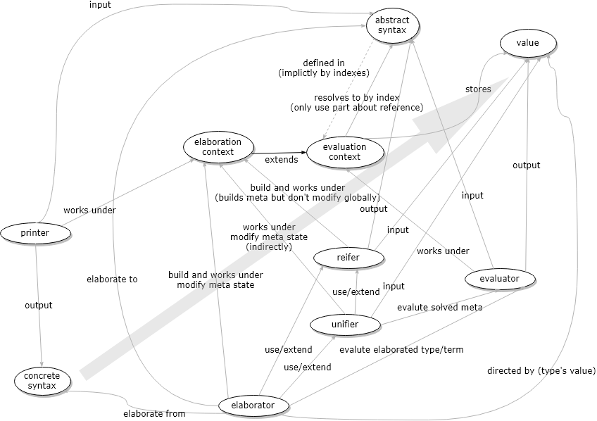

# mlang

under major renovation.

* re-implement new glue/unglue
* implement HITs
* write univalence in library
* write Brunerie's number
* implement new up
* should we design a new value with type annotations?
    * don't use type directed conversion checking anymore, should lambda be type annotated?
    * ~~proper reify without null hacks?~~

---------------

 
 

A cubical type theory implementation with implicit arguments, structural record and sum types and more. see roadmap section for details.

see `tests` and `library` folder for sample code

## build & run & debug & editor setup

the project is written in Scala and is a standard SBT project. it can be cross compiled to Scala.js and Scala JVM. currently we are only compiling on JVM.

to compile use `sbt mainJVM/compile`

the project can be imported into IntelliJ IDEA, and to run/debug, just setup a profile to run `mlang.poorparser.Main` with classpath of module `jvm-main` (or something like this)

we currently have a `.poor` syntax (because we want a better syntax: a structural editor). it uses some wired unicode characters, so to write library code, import `settings.jar` to IntelliJ IDEA, it defines some "Live Templates", or key shortcuts to input certain characters

## help wanted

here are some issues that are easy to do, and they are a good way to familiarize yourself with the project, they are marked with `good first issue` in issues list, and in the code, search for `[issue 123]` where `123` is the issue number will lead you to where need to be modified.

if you need more background on a issue, plz go to gitter and ask.
    
there are other kind of TODOs in the project, they are `LATER`, `TODO`, and `FIXME`, use IntelliJ IDEA to browse them.

the one marked `FIXME` in code is important problems needs expert to figure out.

## roadmap

* **DONE** totally unsafe MLTT basics
    * function types, record types, sum types
    * bidirectional elaborating type checker
    * mutual recursive definitions
    * type directed conversion check with eta and recursive definitions
    * concrete syntax, core syntax, core semantics and reification
    * basic `.poor` syntax and parser
* **DONE** overlapping and order independent patterns, see `plus_tests` in library for detail
* **DONE** cumulative universe with "up" operator for global definitions (see [here](https://mazzo.li/epilogue/index.html%3Fp=857&cpage=1.html))
* **DONE** locally scoped meta; very simple unification; implicit arguments syntax
* cubical features
    * **DONE** path type
    * **DONE** coe, com, hcom; checking, computation for basic types
    * **WIP** V-type and univalence
    * fibrant universe
    * sum type's Kan ops; fcom, higher inductive types
* ~~~~~~~~
* user defined eliminations
    * constant projection `square.constant`
    * projection `1.is_even`
    * user defined patterns
    * user defined implicit right form
* implicit conversions
* pretty printer (from readback abstract syntax)
* record calculus (one problem is dependency graph introduces syntax stuff in equality)
* HTML pretty print with inferred types, cross links
* **SOUNDNESS** positivity checker
* **SOUNDNESS** coverage & confluence checker
* **SOUNDNESS** termination checking: currently you don't need modifier `inductively` to write a recursive type, with termination checking, you should not be able to do this
    * relax the syntax check for inductive definitions
* more recursive types
    * inductive families of two flavor
    * inductive-inductive
    * inductive-recursive
    * is [this](https://arend.readthedocs.io/en/latest/language-reference/definitions/hits/#conditions) sound?
    * coinductive types?
* usability
    * disallow or warn naming shadowing
    * better error reporting
* structural editor
    * modules and compile unit
* testing
    * translate to Agda to do correctness checking
    * core type checker and core type check 
* math
    * quick sort and properties
    * symmetry book
    * cubical Agda
    * Agda stdlib
    * Artin's or Lang's *Algebra*
    * Agda's test cases and it's issues
    * https://ncatlab.org/homotopytypetheory/show/open+problems#higher_algebra_and_higher_category_theory
        * seems interesting: limits problem?
    * https://github.com/HoTT/HoTT
    * unimath
    * the big problems list
    * Agda Katas
* meta-theory
    * compared to CCHM, Copop != C

## internals

* theory
    * basic for MLTT theory see HoTT book first chapters
    * cubical TT see
         * *Cubical Type Theory: a constructive interpretation of the univalence axiom*
         * *On Higher Inductive Types in Cubical Type Theory*
         * *Higher inductive types in cubical computational type theory*
* implementation
    * the type checker is written in a bidirectional way, some reference is
         * *A simple type-theoretic language: Mini-TT*
         * http://davidchristiansen.dk/tutorials/nbe/
    * but the above reference is not incremental, and to do it incrementally: *Decidability of conversion for type theory in type theory*
      * this don't handle recursive definitions, and we use a way inspired by Mini-TT
    * the idea of using JVM as evaluator is from: *Full reduction at full throttle*

------

**some of bellow is out of date and wrong now, it mainly serves as a place to clear up my thoughts**

### relation to `cubicaltt` implementation

there is a `Nominal` typeclass in `cubicaltt`, it is what we have implemented `restrict` which is the `act` method in `cubicaltt`

### universe levels

we use cumulative universes, done in syntax layer, with `up` operator

### dbi core syntax `Abstract`

this class is just core syntax in de bruijn index. it is elaborated from concrete syntax. we don't do any manipulation on it, it is just used to eval to values. the conversion from `Abstract` to `Value` is called `eval`, we have currently a compiler by using the Scala compiler directly

abstract and values is "type free", let expressions don't have types, etc. the context will have the types when needed. this is natural in a type directed way

I think one thing can be done on Abstract is common expression reduction.

references in a abstract term points to context or other part of the term, very standard. recursive definitions is done by mutual references

this is **very straight forward** to understand compared to "value" class

### hoas value `Value`

our value higher order abstract syntax, it use closure of the host language as closure, and mutable cell of host language as reference

we represent recursive references directly by recursive data structure, with a trick of mutation and nulls

values is considered "context free", all operation done on a value don't need to be pass in a context object, but nontheless, you need to know if a value is valid in current context, for eaxmple reading back a value defined locally in a global context will result in rebinding error

unlike normalization by evaluation, redux (application, projection, cubical hcom etc.) etc is translated to values, not directly performing the operation. this is because elaborator needs to fill holes by reify from value, and directly normalizing all redux (out side of a closure) will make the term very big

values can be manipulated like syntax, like restriction, reify, support. but you need to maintain the mutual reference, it is a little bit trickier, but not much

#### reductions

but most importantly values can have whnf. this is not a syntactical operation.

we have weak head normal form defined on hoas, `wnhf`, the `app` closure application is call-by-need because we implemented whnf caching

### elaboration

elaboration is standard bidiractional elaboration

#### recursive elaboration

for a item that previously declared but not defined, when it is defined, we re-evaluate all stuff that depends on it recursively and rewire the pointers, these ones refers to a open variable before

### types system

#### structural data types

unlike almost all implementations, we try to treat type definitions structural. validity of recursive definitions can mostly done by syntax restrictions, just like how people makes "nested inductive definitions" works (I suppose). so there is no "schema" of parameterized inductive type definitions, just recursive sum types under a telescope, the "schema" then is a semantics level predicate, not syntax level construction

but for recursive types, they cannot have structural equality, so currently we restrict them to be defined on toplevel, also make them has nominal equality (id'ed `Sum` and `Record` type, just like id'ed pattern expressions)

we don't allow parameterized ones yet. but this is a easy fix

### conversion checking

the conversion checking is type directed conversion checking, but as we use hoas, open variables have a nominal equality, and we don't do index shuffling

the assumptions is: values is well typed, although values don't have type annotations, but for example a stuck term of application, if you know the left hand side has a function type, then you know that right hand side has the type of the domain

so the algorithm is type directed is in this sense: the type is a **assertion** that both terms has a certain type, the level input of `equalType` is a **assertion** that both type is smaller than a certain level, the output of a equality check is a **assertion** that the term is definitional equal.

in case of `equalNeutural`, there is no assertion that the two input is of the same type, it has a return type `Option[Value]` and `Some(v)` is a **assertion** that the two neutral type is of the same type, **and of the same value** and the type is `v`

the conversion checking handles recursive definitions by memorizing equalities between path lambdas, **here we have a assumption all term level recursion is done inside a pattern matching closure** this is somehow inspired by Mini-TT

something similar should be possible with recursive type definitions, in this case, we should treat the recursive references as "open" and do caching

at least we want to be semi-decidable, this allows more equality to be checked.

### meta variables

#### local representation in `Abstract`

conceptually, implicit variables and meta variables are *just* (abstract in the sense before) terms that omitted and can be inferred from other part of the term.

in this sense, each new scoping have a list of definitions like a let expression. and in abstract code, each closure do have a list of meta values, and each usage is also a closed meta reference to them.

for closure, let expression and telescopes in record and sum type, we have 3 different way of representing them in abstract world

we don't explicitly present metas in value world, like we have direct references in value world. it can still be reified, just read it in current closure

#### context representation

we make sure all meta is solved when a context is closed, this way the solved meta can generate abstract properly. see `finishReify` usages

#### in value world

we are not using an contextual monad, but directly using mutation and using JVM referential equality.

we represent not solved metas directly by a holder value with no value solved, we maintain so that all references is the same *JVM object*, so setting a value for it set for all references. closing a context will ensure all metas is solved

also adding a new meta is direct mutate the context. 

having mutable metas and mutable context means our values is mutable.

this means: unification and type checking is side-effecting. this means one need to be careful when writing these code. call order maters. you should `finishReify` at the last thing you do in this context.

also this means whnf is not stable in some cases. this seems to be transparent to outside of `Value.scala`

other than this, our algorithm is pretty ignorance about metas. open metas is much like a generic variable, closed metas is much like a reference, when evaluation on them doesn't work, we just stuck, when unification doesn't work, just return false. what can be wrong with this? (funny face)

so the only thing is to keep in mind that unifier/typechecking is side-effecting

one thing keep in mind is closure DON'T create new open metas, all open metas is currently in context

so a value with a solved meta behaves much like a normal value. a value with a open meta does not. it is kind of a value with undetermined part, so reify works on it, support works on it, but restrictions currently not (see bellow)

#### meta solving

we use the most simple meta solving algorithm, no constraint etc.

### kan types

#### restrictions

restricted layer happens for face expression, and glues.

we don't allow restricting a open meta for now, because it has indefinite support, for example a restricted open meta might turns wrong when it has value, because the value is not restricted and might contains names in the restriction. this is not a theoretical bad problem, because you can always fill in the meta values. but in practice we don't know yet

#### kan ops

we have `hcom`, `coe` as eliminations, in a normalized closed value, they should not appear. they interact with restrictions, just like a path lambda interact with dimensions, then they are inductively defined on all type formers

how to verify computation rules: they must preserve types, they must preserve properties of kan ops (stationary hcom/coe and face hcom)

